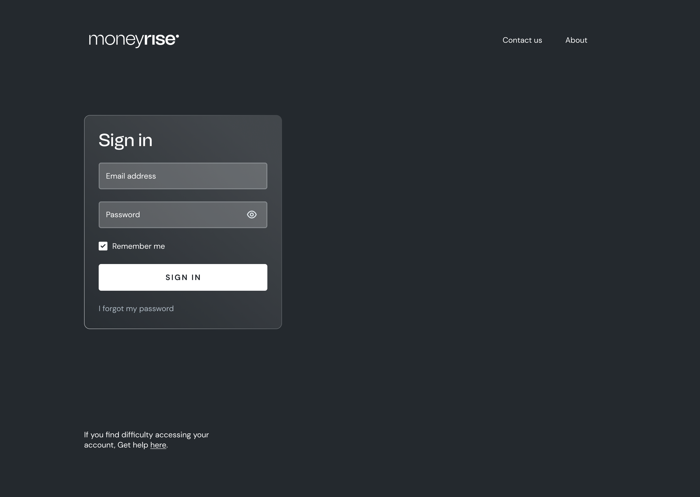

# Rise Frontend Internship Test
We just need to confirm you have what it takes. Good luck 

## Rules
* Fork this repository, so it can stay on Github
* Commit your changes after every task
* When you finish, send us link to your repository and wait for an answer

## Prerequisites
- [Node.js](https://nodejs.org/en/)
- [yarn](https://yarnpkg.com/)
- [React](https://reactjs.org/)


## Installation
Bring up a terminal, then go to your project root directory and install local dependencies:

```yarn```

To start local dev server, type in the following command in your terminal:

```yarn start```

You should now see the working project page on [http://localhost:3080](http://localhost:3080)



### Task 1
Design and implement the image above

### Task 2
Add a simple JS validation to the login form. Submit button should have hover effect that changes it's background color. Please notice checkbox's custom look.


## Send us your repo!
After finishing all tasks, reply the mail that sent you this repo with a link your repo.
